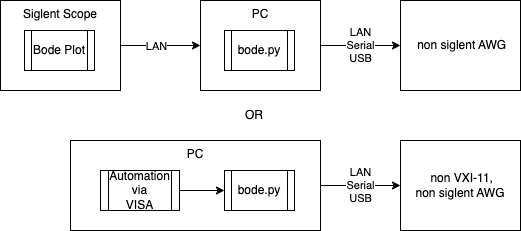

# Siglent SDS1000X-E/SDS800X-HD/SDS1000X-HD series Bode Plot

Bode plot with Siglent oscilloscopes (SDS1000X-E, SDS800X-HD, SDS1000X-HD, and probably others) and a non-siglent AWG.

Can also be used as a regular VXI-11 front-end for the supported AWGs, without the Siglent scope.



## Overview

At a certain point after getting the SDS1204X-E oscilloscope I started to wonder if it might be possible to use the Bode plot function with a non-Siglent waveform generator. After some hours of researching and reverse engineering I wrote this Python program which is a small server which emulates Siglent arbitrary waveform generator.

The oscilloscope connects using LAN to a PC running this program. The program makes the oscilloscope think that it communicates with a genuine Siglent signal generator. The program extracts the commands sent to the generator, parses them and translates to the command set, which can be understood by the connected to the PC non-Siglent generator.

This tool can also be used to control the supported AWGs via other VISA tools, independently of a Siglent scope. It supports discovery over the network.

The current version of the program was tested under Linux and MacOS only. It will likely work under Windows too, with an up to date python version.

## Supported AWG Models

As of September 2024 the program supports the following models:

* **Uni-Trend UTG1000x (like the UTG1022X)** This is a 2 channel 40MHz AWG. It connects to the PC via USB, and talks a dialect of the SCPI 1992.0 standard. There may be other devices that use this same dialect, so you may be able to use this driver for other AWGs. ```port``` must be a Visa compatible connection string. See below.

* **Rigol DG800/DG900/DG1000Z series (like the DG811..DG992 and DG1062Z)**. When "liberated", those are  2 channel up to 100MHz AWGs with USB and ethernet interface [^1], that talks a dialect of the SCPI 1992.0 standard. There may be other devices that use this same dialect, so you may be able to use this driver for other AWGs. ```port``` must be a Visa compatible connection string, be it USB or ethernet. See below.

    [^1]: On the DG800/DG900, the ethernet interface requires a suitable adapter. It is however strongly recommended to use this interface.

* **BK Precision BK4075** One channel 25MHz AWG. ```port``` must be a serial port. You must also provide ```baud_rate``` if you use another speed than 19200. See below. You might also be able to get this AWG working via the visa driver.

* **RD JDS6600** Chinese generator which is widely sold on eBay and AliExpress. This driver may also work on others from the same series, like the JDS2900. ```port``` must be a serial port. See below.

* **Feeltech FYxxxx** A range of Chinese generators. This driver is a newer driver than has some improvements over the older FY6600 driver, and supports FY2300, FY6600, FY6800, the older FY6900 and probably more. ```port``` must be a serial port. See below.

* **Feeltech FY6900** A Chinese generator. This driver has some improvements that are needed for the later FY6900 versions, that require the frequency to be sent as Hz instead of uHz. For the rest it is the same driver as the generic FY driver. ```port``` must be a serial port. See below.

* **Feeltech FY6600** Another Chinese generator which is widely sold on eBay and AliExpress. This is an older driver that has less checking. Use it when the above drivers do not work. This will however mean that some changes to the above drivers might be needed. ```port``` must be a serial port. See below.

* **AD9910 Arduino Shield** [DDS AD9910 Shield](https://gra-afch.com/catalog/rf-units/dds-ad9910-arduino-shield/). ```port``` must be a serial port. See below.

## Oscilloscope Configuration

Before starting the program you have to tell the oscilloscope how to connect to the waveform generator. Connect your oscilloscope to the same network where your PC is connected. Then go to ```Configure => AWG I/O``` in the Bode plot settings. Define LAN connection and the IP addres of your PC as the AWG IP. Please keep ```Amplitude Unit``` to ```Vpp```. This program does not (yet) support other units.

When you start the program, it will automatically test the communication between the PC and the AWG, and start the AWG server on the PC. Once the program is up and running, you can press the ```Test Connection``` button on the oscilloscope to test the communication between the oscilloscope and the PC.

## Requirements

To run this program you must have Python 3.8+ installed. Python 2.7 is not supported anymore.

You will need the following pip packages:

* ```pyserial```
* ```PyVISA```
* ```PyVISA-py```

If you have an old python version, you may also need to upgrade the ```typing_extensions``` version (as required by PyVISA-py).

## Running The Program

The source code is located in the [```sds1004x_bode```](/sds1004x_bode) directory of this repository.

Under Linux, Python ```sockets``` requires elevated privileges, therefore the program has to be run with ```su``` or ```sudo```, or better, allow python access with a command like ```sudo setcap 'CAP_NET_BIND_SERVICE+ep' /bin/python3.10``` (to be adapted to your situation). On MacOS and Windows you likely will not need all this.

The program must be run in a command line terminal. The file to be run is ```bode.py```. In order to run it, change the current path to the directory where you downloaded the source code. Then write the following command:

```python bode.py <awg_name> [<port>] [<baud_rate>] [-h] [-v[v[v]]]```

where

* ```<awg_name>``` is the name of the AWG connected to your PC:  ```jds6600```, ```bk4075```, ```fy```, ```fy6900```, ```fy6600```, ```ad9910```, ```dg800```, ```utg1000x``` or ```dummy```.

* ```<port>``` is the port to which your AWG is connected. The type depends on your AWG, see the explanations above. For serial port AWGs, it will be something like ```/dev/ttyUSB0``` or ```/dev/ttyACM0```. If you use the ```dummy``` generator, you don't have to specify the port. If you use one of the SCPI compatible devices like the ```dg800``` or ```utg1000x```, you must specify a Visa compatible connection string, like ```TCPIP::192.168.001.204::INSTR``` or ```USB0::9893::6453::DG1234567890A::0::INSTR```

* ```<baud_rate>``` The serial baud rate as defined in the AWG settings. ```bk4075``` uses a default speed of 19200. All others run on 115200, and this parameter will be ignored for them.

The ```dummy``` generator was added for running this program without connecting a signal generator. The program will emulate a Siglent AWG and the oscilloscope will generate a Bode plot but no commands will be sent to the AWG.

Use ```-h``` for help text.

Use ```-v``` or ```-vv``` or ```-vvv``` for logging verbosity. The first logs the driver info, the next also logs VXI-11 info, the last also logs port mapper info. By default, only the startup phase and the incoming commands are logged.

If the program starts successfully, and with ```-vvv```, you'll see the following output:

```text
Initializing AWG...
AWG: jds6600
Port: /dev/ttyUSB0
IDN: jds6600
AWG initialized.
Starting AWG server...
Portmapper: Listening to UDP and TCP ports on 0.0.0.0:111
VXI-11: Listening to TCP port 0.0.0.0:9010
```

After starting the program, follow the usual procedure of creating Bode plot. After starting the plotting, the program output will be similar to the following (when using ```-vvv```):

```text
UDPPortmapper: Incoming connection from 192.168.14.27:55916.
UDPPortmapper: Sending to TCP port 9009
VXI-11 CREATE_LINK, SCPI command: inst0
VXI-11 DEVICE_WRITE, SCPI command: IDN-SGLT-PRI?
VXI-11 DEVICE_READ, SCPI command: None
VXI-11 DESTROY_LINK, SCPI command: None
VXI-11 moving to TCP port 9010
UDPPortmapper: Incoming connection from 192.168.14.27:48446.
UDPPortmapper: Sending to TCP port 9010
VXI-11 CREATE_LINK, SCPI command: inst0
VXI-11 DEVICE_WRITE, SCPI command: C1:OUTP LOAD,50;BSWV WVTP,SINE,PHSE,0,FRQ,15000,AMP,2,OFST,0;OUTP ON
> C1:OUTP LOAD,50;BSWV WVTP,SINE,PHSE,0,FRQ,15000,AMP,2,OFST,0;OUTP ON
VXI-11 DESTROY_LINK, SCPI command: None
VXI-11 moving to TCP port 9009
UDPPortmapper: Incoming connection from 192.168.14.27:50264.
UDPPortmapper: Sending to TCP port 9009
VXI-11 CREATE_LINK, SCPI command: inst0
VXI-11 DEVICE_WRITE, SCPI command: C1:BSWV?
> C1:BSWV?
VXI-11 DEVICE_READ, SCPI command: None
VXI-11 DESTROY_LINK, SCPI command: None
VXI-11 moving to TCP port 9010
UDPPortmapper: Incoming connection from 192.168.14.27:55976.
UDPPortmapper: Sending to TCP port 9010
VXI-11 CREATE_LINK, SCPI command: inst0
VXI-11 DEVICE_WRITE, SCPI command: C1:BSWV FRQ,10
> C1:BSWV FRQ,10
VXI-11 DESTROY_LINK, SCPI command: None
VXI-11 moving to TCP port 9009
UDPPortmapper: Incoming connection from 192.168.14.27:48088.
UDPPortmapper: Sending to TCP port 9009
VXI-11 CREATE_LINK, SCPI command: inst0
VXI-11 DEVICE_WRITE, SCPI command: C1:BSWV FRQ,20
> C1:BSWV FRQ,20
VXI-11 DESTROY_LINK, SCPI command: None
VXI-11 moving to TCP port 9010
```

When done, you can stop the process via Ctrl-C.

## Some possible errors

If you get an error message with  ```Address already in use. Cannot use ... for listening.```, use ```netstat``` or ```lsof``` to look what process is already using the port. It might be because you have nfs.server running via rpcbind. For that case, just disable it while running the bode plot: ```sudo systemctl stop rpcbind.socket rpcbind.service```.

## Support for other AWGs and Contributing

I'd like to add here more AWGs but it's impossible to have them all at the home lab, so I have to rely on your cooperation for the adding of more drivers.

If you have an AWG that is not listed, but is compatible with one of the existing drivers (which is more easily the case with SCPI AWGs of the same brand), tell us so (via github Issue or Pull request), so that we can add the device to the list.

If you have an AWG that is not compatible, you often can create a new driver easily by using one of the existing drivers as example. Especially SCPI drivers are easy to do. Again, please tell us if you have done so (via github Issue or Pull request), so that we can add the driver.

For driver testing, you can use [```awg_tests.py```](/sds1004x_bode/tests/awg_tests.py). Adapt it to your device and address, and it will test all commands.

## Using independently from the scope, via VISA

This is possible, but you should set a large timeout on your ```Instrument``` or when using ```open_resource()``` when using serial AWGs. See the example in [```testSCPI.py```](/sds1004x_bode/tests/testSCPI.py)

## Changelog

### 2025-01-16

* easier testing of new drivers

### 2024-09-19

* new driver for newer fy6900 devices.
* better serial port handling for some drivers.
* better VISA compliance: no longer a need to specify UDP or not. This version listens on both UDP and TCP and is therefore compatible with most VISA tools and older plus newer Siglent scopes.
* better logging handling, now available in 4 verbosity levels

### 2024-09-06

* compatibility with older Python versions (tested down to 3.8).
* better exception handling on port opening.

### 2024-08-25

* lint cleanup.
* added generic fy gen support (FY2300, FY6600, FY6800, FY6900 and probably more) from the [3tch-a-sketch and mattwach forks](https://github.com/3tch-a-sketch/sds1004x_bode)
* readme clarifications.

### 2024-06-27

* Added support for Uni-Trend UTG1000x

### 2024-05-01

* The program supports the SDS800X-HD series (that uses UDP instead of TCP for the port mapping, and has trouble with re-using the VXI port)
* Added support for the Rigol DG800/DG900 series AWGs over Ethernet. USB was not tested, but should work. You might even use this implementation to connect to other Ethernet or USB connected SCPI 1992.0 standard compatible devices.

### 2023-11-13

* The program supports the AD9910 Arduino Shield sold by [GRA & ACFH](https://gra-afch.com/catalog/rf-units/dds-ad9910-arduino-shield/).

### 2019-01-30

* The program supports Feeltech FY6600 AWG.

### 2018-07-18

* The first version of the program was uploaded to GitHub.

## Follow-up Projects

* [espBode](https://github.com/awakephd/espBode) - an interface between a Siglent SDS1000X-E/SDS800X-HD/SDS1000X-HD scope and FY AWGs implemented on ESP-01 module. This is a complete rewrite of various espBode repos for only SDS1000X-E, like https://github.com/Hamhackin/espBode and https://github.com/PanKaczka/espBode.

## Authors

* **Dmitry Melnichansky [@4x1md](https://github.com/4x1md)** - Project idea and implementation.

* **hb020** - Allow use with the newer SDS800x HD (12 bit) scopes, Driver for Rigol DG800/DG900 series, maintenance since May 2024.
  
* **Nick Bryant (Dundarave on EEVblog Forum)** - Driver for Feeltech FY6600 AWG.

* **Don F Becker** - Driver for AD9910 Arduino Shield.

* **alfredfo** - driver for Uni-Trend UTG1000x.

* **3tch-a-sketch** - generic Feeltech FY driver.

## Links

1. [Siglent SDS1104X-E and SDS1204X-E: Bode plot with non-Siglent AWG](http://www.eevblog.com/forum/testgear/siglent-sds1104x-e-and-sds1204x-e-bode-plot-with-non-siglent-awg/) on EEVblog Forum.
2. [Running the script with SDS1204X-E and JDS6600 AWG](https://www.youtube.com/watch?v=7PvueUHAJ78) on YouTube (best viewed in 1080p quality).
